# data-structure-8
## 10 堆  
让班主任在班里找出成绩前10的同学，就把班里所有人的成绩排序，然后取前十名。但是如果说要把全省的前十名取出来，难道要对全省的所有人成绩排序？？？堆就是专门用来解决这种问题的  
### 堆的特点：  
1.堆是一个二叉树  
2.叶子节点只存在最下面两层；从根节点到倒数第二层是一个完全二叉树  
3.一个节点不可能只有右孩子  
4.一个节点的左孩子和右孩子都比这个节点大（或者小）
  
### 堆的操作：  
1.维护堆的状态  
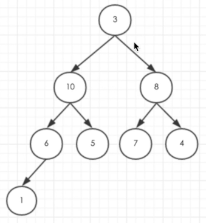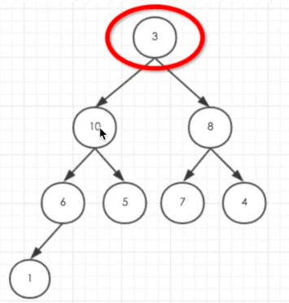 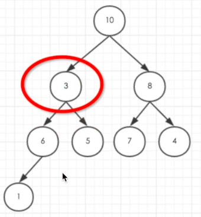 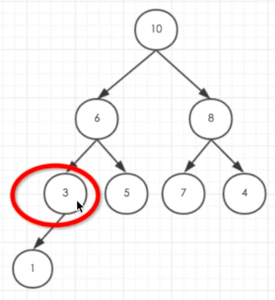   
2.建堆  
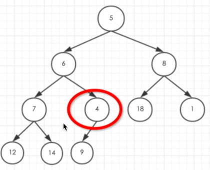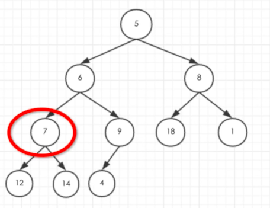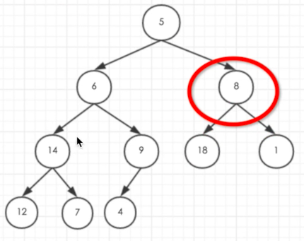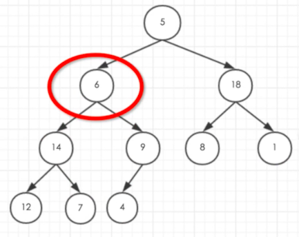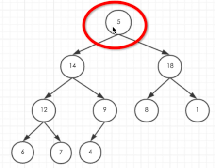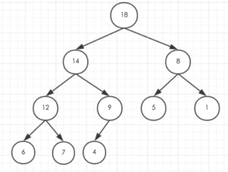  
3.取堆顶（每次把最大值取走，然后把最后一个叶子的值放到堆顶的位置，再采用维护堆状态的方法进行变换）  
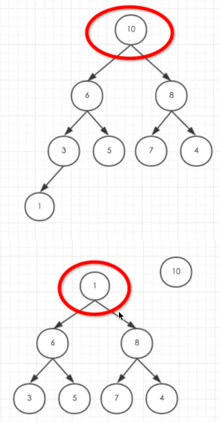   
4.新增数据  
插入数据的同时要满足堆的条件，所以尽量在最后一层往左插  
